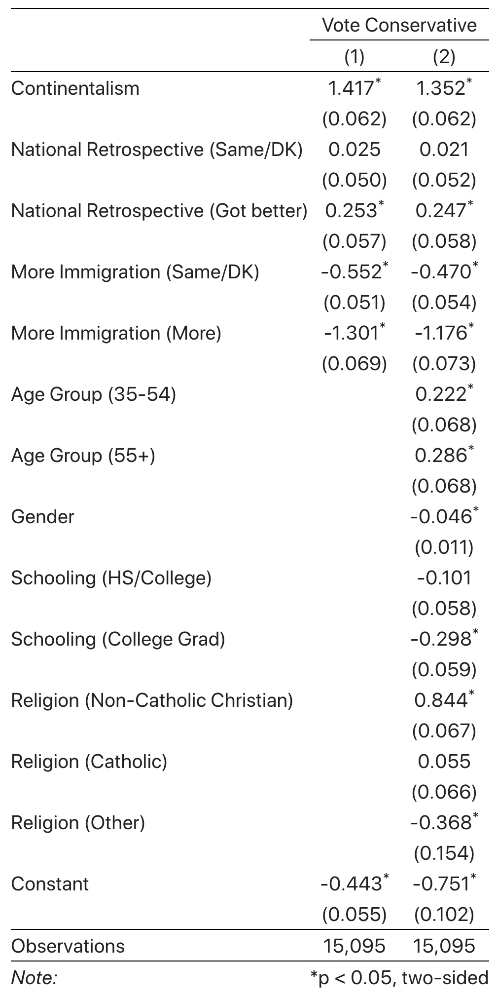
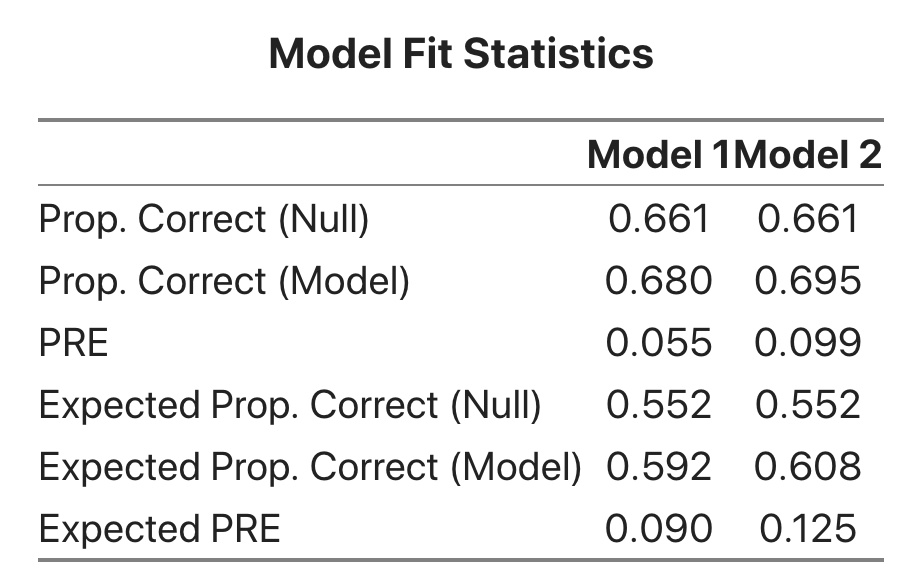

## Understanding the Output

The output you are seeing above provides logistic regression coefficients for the regression of the dependent variable on the set or sets of independent variables chosen.  All of the results generated above use probability weights and were generated by the `survey` package in R.  For the sake of discussion and explanation, I have generated an example of the results you see above here: 

The model here is a binary GLM.  If we were going to write out an equation for model 1, we would write it as: 

$$
\begin{aligned}
log\left(\frac{Pr(\text{Liberal Vote})}{1-Pr(\text{Liberal Vote})}\right) &= b_0 + b_1\text{Female} + b_2\text{Age 33-54} + b_3\text{Age > 54}  + \\\\
&+ b_4\text{Market Liberalism} + b_5\text{Moral Traditionalism}\\\\
&+ b_6\text{HS/College} + b_7\text{College Grad} 
\end{aligned}
$$

In a logistic regression, the dependent variable being modeled is the log of the odds of the dependent variable equaling one.  The coefficients, then, give the change in the log-odds of voting liberal for a one-unit change in the variable.  This is neither a particularly intiutive metric for people nor is it especially illuminating regarding the actual predicted probability of a liberal vote.  As such, the coefficient table above is not as useful as it might be in a linear regression model.  

In that table, the main entries are the logistic regression coefficients and the values in parentheses are the standard errors.  The standard error is the standard deviation of the coefficient's sampling distribution.  Just like any standard deviation, it tells us the average distance of observations from the mean.  In the case of a sampling distribution, it tells us, on average, how far sample statistics are (in repeated sampling) from the true, but unknown population parameter.  In the output above, a coefficient is flagged as significant (by an asterisk) if its $p$-value is less than 0.05.  These indications of statistical significance from the table can help identify variables whose effects should be investigated further.  

The "Plot" and "Predicted Probabilities" tabs will give other ways of evaluating the effect of the variable.  Descriptions of the methods and how they should be interpreted appear in those tabs.  

Another importance piece of information we can get from the output is the fit of the model.  The model fit output looks like this: 

There are two metrics here used to evaluate model fit.  The first is the proportional reduction in error (PRE).  The PRE captures the improvement that the model makes in predicting the outcome (Liberal vote in this case) versus guessing.  For example, imagine that we surveyed 10 voters and we knew that 6 of them voted Liberal and 4 voted for some other party.  How many voters would we be able to guess correctly for certain?  The answer, though perhaps not intuitive at first, is six. We could always guess the six Liberal voters correctly by guessing that everyone was a Liberal voter.  In general, we could always guess correctly the number of observations in the bigger of the two categories.   

Now, imagine with our voting model we correctly predicted 8 of the voters. We figure out the predicted category of an observation by its predicted probability.  If the predicted probability is bigger than 0.5, we would predict the observation to be a 1 (in this case, a Liberal voter).  Otherwise, we would predict the observation to be a 0 (in this case, a voter for a party other than the Liberals).  The PRE calculates by what proportion we have reduced our prediction errors over guessing.  The PRE is defined as: 

$$\text{PRE} = \frac{\text{PCP} - \text{PMC}}{1-\text{PMC}}$$

Here, PMC is the proportion in the modal category.  In our toy example about Liberal voters, it would be $\frac{6}{10} = 0.6$.  The PCP is the proportion correctly predicted by the model.  In our example, the PCP would be $\frac{8}{10} = 0.8$.  Now, we have everything we need to calculate the PRE: 

$$\text{PRE} = \frac{0.8-0.6}{1-0.6} = \frac{0.2}{0.4} = 0.5$$

What this tells us is that we were able to reduce the number of errors we made by 50%.  Initially, by guessing, we made four errors and with our model we reduced that by 50% to only 2 errors.  We find this to be a pretty useful way of thinking about how models fit.  In the model output just above, we see that the proportion in the biggest category is 0.685 and that is also the proportion we predict correctly, so the PRE is 0.  

The ePRE is the "expected Proportional Reduction in Error".  This is like the PRE, but also incorporates the fact that our predictions are never certain.  We don't want to belabour the mathematical exposition here, but you can look at Michael Herron's [article](https://bit.ly/39zpkFD) for a more fulsome discussion. The gist is that sometimes we are able to make the predicted probability of the observations closer to its observed values without changing the category in which we would predict the observation.   For example, we could increase the predicted probability of voting liberal for a liberal voter from 0.3 to 0.45.  The second prediction is better than the first because we have increase the probability with which we would predict the observation correctly, but we still didn't cross the 0.5 threshold.  Thus we wouldn't have actually correctly predicted the observation, but we would be closer. 