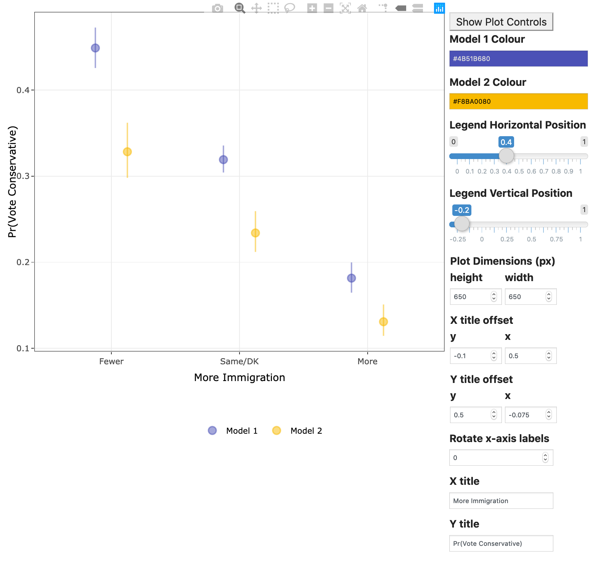
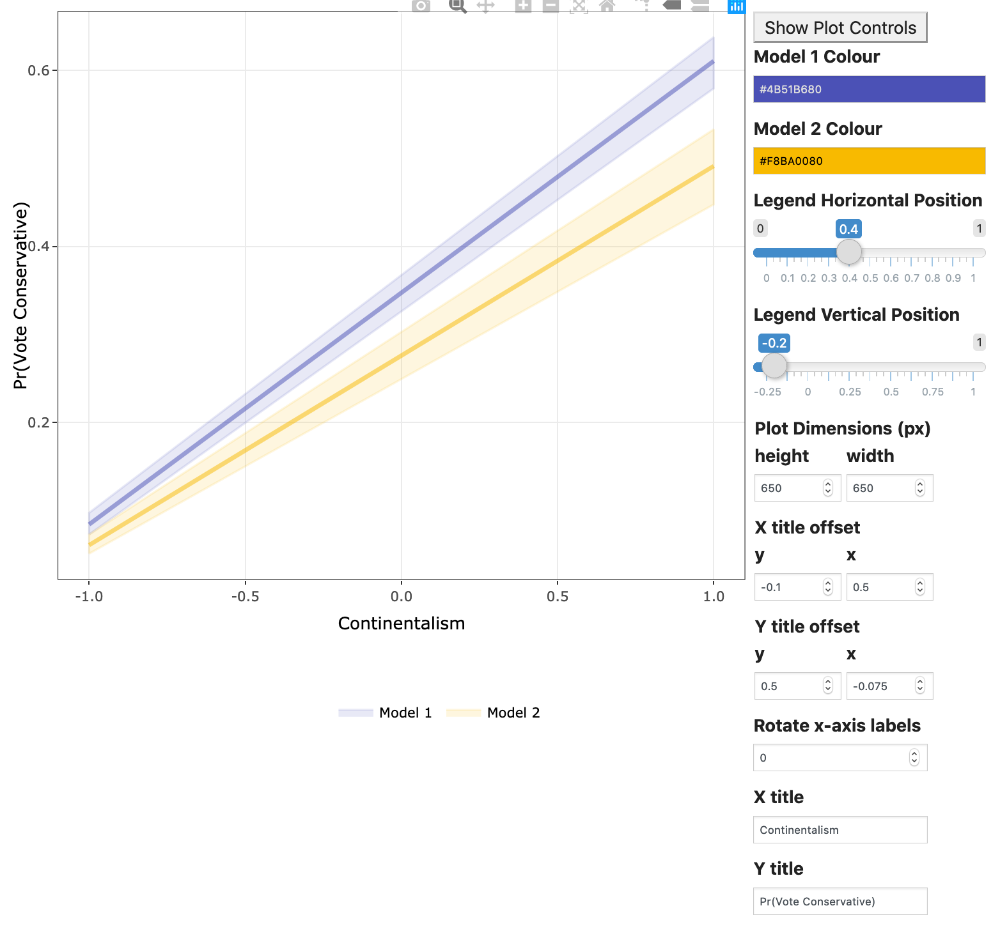

```{r setup, include=FALSE}
knitr::opts_chunk$set(echo = TRUE)
```


## Understanding the Output

The output you are seeing above is a plot of predicted probabilities for the "Independent Variable of Interest".  This is one way of understanding the "effect" of a variable.  In the plot above, the points or solid line represent the effect, the predicted probability of the dependent variable being 1 given the particular value (on the $x$-axis) of the independent variable of interest.  The lines or bands give a 95% confidence interval.  This could be interpreted as the range of plausible values of the population parameter given the particular value of the independent variable of interest.  

In the interest of making this a bit less abstract, consider the first example below:



Here, we see that moving from the lowest age group in model 1 (where the probability of voting liberal is around 0.26) to the highest age group (where the probability of voting liberal is around 0.31) changes the predicted probability of voting liberal by about 0.05.  Those same changes in age make a difference of $0.35-0.28=0.07$ in the probability of voting liberal in model 2 (controlling for education, market liberalizm and moral traditionalism, in addition to gender which is also in Model 1).  The "Predicted Probabilities" tab gives you more detailed numerical information about the those values that are in the plot. 

The plot above gets produced if you choose a categorical (aka qualitative, nominal/ordinal) variable from the "Independent Variable of Interest" selector.  If you choose numerical (aka continuous, quantitative, interval/ratio) variable from the "Independent Variable of Interest" selector, you get a line plot like the one below.  The plot shows us that market liberalism decreases the likelihood of voting for the Liberals in both models.  The probability of voting Liberal goes from about .41 to about .27 for a difference of 0.14 across the range of the varaiable.  The effect gets smaller when we control for Catholic and moral traditionalism instead of education(as we do in model 2).  There, the probability of voting Liberal goes from .36 for those on the low end of the scale to .29 for those on the high end of the scale, for a difference of 0.07.  



These plots can be very useful for demonstrating the effect of a variable.  There are two options that can be used to produce the prediction.  

#### Average Case Approach

The _average case approach_ constructs a representative observation, normally by choosing the modal category for categorical variables and the median value for quantitative variables.  We hold constant all but one variable (call these $\mathbf{x}_{i-j}$ which we hold constant at $\mathbf{x}_{0-j}$) at these representative values.  For the variable of interest (call it $x_{ij}$), we choose $m=\{m_1, m_2, \ldots, m_M\}$ different values across the variable's range.  For quantitative variables, these could be quantiles or evenly spaced values.  For categorical variables, generally these would be all of the different values of the variable.  We would then get the predicted probability: 

$$
\begin{aligned}
\eta_k &= b_jx_{j} + \mathbf{b}_{-j}\mathbf{x}_{-j}\\
\widehat{Pr(y_i = 1| \mathbf{x}_i = m_k, \mathbf{x}_{j} = \mathbf{x}_{0,-j})} &= \frac{1}{1+e^{-\eta_{k}}}.
\end{aligned}
$$
    
We then plot the predicted values against $m_k$ with a measure of uncertainty - error bars around points for categorical variables of interest and lines with confidence envelopes for quantitative variables.  

#### Average Effect Approach

The _average effect approach_ operates a bit differently.  Here, we take each observation in turn.  For each of the $N$ observations, we have the dependent variable value $y_i$ and the vector of independent variables that we break into two parts $x_{ij}$ is the value for the "Independent Variable of Interest" with coefficient $b_j$ and $\mathbf{x}_{i-j}$, with coefficients $\mathbf{b}_{-j}$.  We then calculate the predicted probability as 
  
  $$
  \begin{aligned}
  \eta_i &= b_jx_{ij} + \mathbf{b}_{-j}\mathbf{x}_{i-j}\\
  \widehat{Pr(y_i = 1| \mathbf{x}_i)} &= \frac{1}{1+e^{-\eta_{i}}}
  \end{aligned}
  $$
For each observation, we calculate the predicted probability holding $\mathbf{x}_{i-j}$ constant and then moving $x_{ij}$ across the range of the variable.  For categorical varaibles this would mean choosing each $m$ level of the total $M$ levels of the categorical variable in turn.  For quantitative variables, this would mean choosing $M=\{m_1, m_2, \ldots, m_M\}$ different levels across the range of the $x_{ij}$ varable.  This results in $\widehat{Pr(y_i=1|x_{i,j}=m_k, \mathbf{x}_{i-j})}$,  which we average across all of the $i = \{1, 2, \ldots, N\}$ observations.  We then make a plot of $\widehat{Pr(y = 1 | x_{j} = m_k, \mathbf{x}_{-j})}$ against $m_k$ along with confidence intervals calculated through a parametric bootstrap. 


