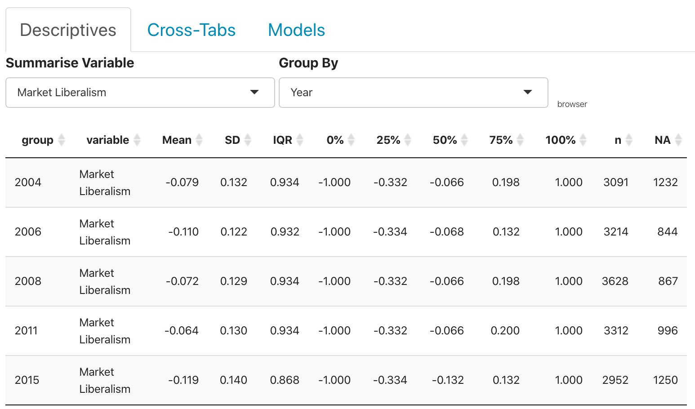
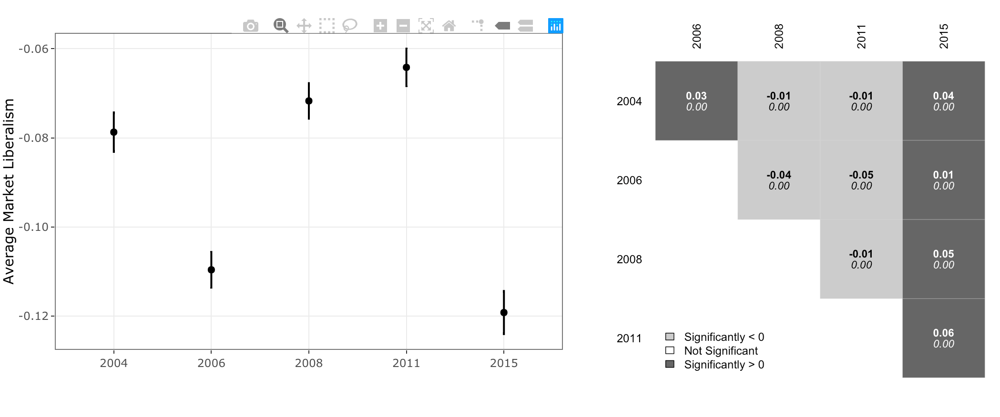

## Understanding the Output

The output you are seeing above provides summary statistics for the selected variable.  All of the results generated above use probability weights and were generated by the `survey` package in R.  For the sake of consistency, I have generated an example of the results you see above here: 

Here is a brief description of all of the fields in the output.  

  - `Group` in this case, the group variable will simply say "All Observations".  If you choose a variable from the "Group By" box, this would identify the group used in the summary. 
  - `variable` This identifies the variable being summarised. 
  - `Mean` is the weighted mean across all observations of the variable you chose.  One common interpretation of the mean is the centre of the distribution of the data.  This is calculated with the `svymean()` function. 
  - `SD` is the weighted standard deviation of all of the observations on the variable you chose.  The standard deviation gives the average difference from the mean. This is computed with the `svyvar()` function.  
  - `0%` is the minimum of the data. 
  - `25%` is the first quartile - the number that puts 25% of the distribution below it and 75% of the distribution above it. 
  - `50%` is the median - the number that puts half of the distribution of the variable above it and half below it. 
  - `75%` is the third quartile - the number that puts 75% of the distribution below it and 25% of the distribution above it. 
  - `100%` is the maximum of the data. 
  - `IQR` is the inter-quartile range.  This is the third quartile minus the first quartile. 
  - `n` is the number of valid (non-missing) observations for the variable. 
  - `NA` is the number of missing observations for the variable. 

These values help understand how spread out the observations are in the variable.  By selecting a variable from the "Group By" selector, all of the above quantitites are produced for the observations in each group.  For example, in the _Market Liberalism_ variable depicted right above, we see that the minimum is -1 and the maximum is 1 in each year.  The mean and median are both less than zero for all years indicating that more people have negative feelings about market liberalism than positive feelings.  We can also see that over time, there does not appear to be a strong trend as the average seems to go up and down across the years almost at random.  

There is also graphical output that gets produced.  The plot with points and lines on the right gets made whenever there is a grouping variable and the factorplot (the one with boxes on the left) is produced when there are three or more groups in the summary.  

The plot with the points and lines gives the average of the "Summarise Variable" (in this case, _Market Liberalism_) along the vertical axis for each of the different groups in the "Group By" Variable (arrayed along the horizontal axis).  The lines are 95% confidence intervals.  This gives a range of plausible values for the population average.  This display is designed with [plotly](https://plot.ly/r/).  Hovering over the figure will activate several buttons on the top-right of the figure.  The one that looks like a camera  will allow you to download the plot as a `.png` file.  

The second figure in the display (the one with boxes) tells you whether there are significant differences between the averages for the different groups.  For example, the upper-left hand corner box gives the average market liberalism for 2004 minus the average market liberalism for 2006.  The dark gray color means that the row value (market liberalism for 2004) is significantly bigger than the column value (market liberalism for 2006).  Looking at the box next to that one moving right, the light gray color shows that average market liberalism for 2004 is significantly less than average market liberalism in 2008.  While all differences are statistically significant here, if any had not been, the box would be colored white. This simply adds a bit of extra information to the context allowing you to make more evaluate interesting hypotheses without guessing based on the overlap of confidence intervals. 

