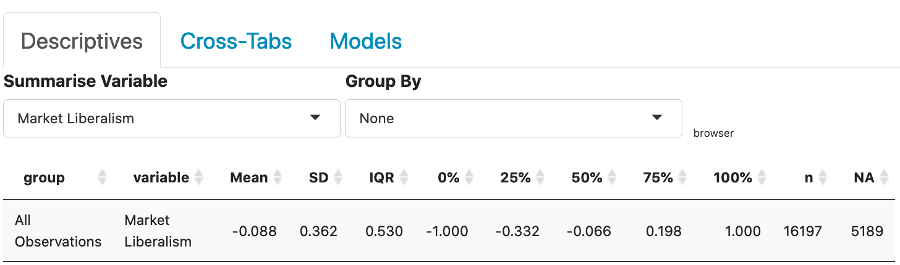
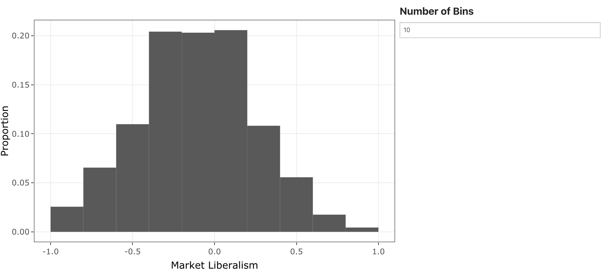

```{r setup, include=FALSE}
knitr::opts_chunk$set(echo = TRUE)
```

## Understanding the Output

The output you are seeing above provides summary statistics for the selected variable.  All of the results generated above use probability weights and were generated by the `survey` package in R.  For the sake of consistency, I have generated an example of the results you see above here: 



Here is a brief description of all of the fields in the output.  

  - `Group` in this case, the group variable will simply say "All Observations".  If you choose a variable from the "Group By" box, this would identify the group used in the summary. 
  - `variable` This identifies the variable being summarised. 
  - `Mean` is the weighted mean across all observations of the variable you chose.  One common interpretation of the mean is the centre of the distribution of the data.  This is calculated with the `svymean()` function. 
  - `SD` is the weighted standard deviation of all of the observations on the variable you chose.  The standard deviation gives the average difference from the mean. This is computed with the `svyvar()` function.  
  - `0%` is the minimum of the data. 
  - `25%` is the first quartile - the number that puts 25% of the distribution below it and 75% of the distribution above it. 
  - `50%` is the median - the number that puts half of the distribution of the variable above it and half below it. 
  - `75%` is the third quartile - the number that puts 75% of the distribution below it and 25% of the distribution above it. 
  - `100%` is the maximum of the data. 
  - `IQR` is the inter-quartile range.  This is the third quartile minus the first quartile. 
  - `n` is the number of valid (non-missing) observations for the variable. 
  - `NA` is the number of missing observations for the variable. 

These values help understand how spread out the observations are in the variable.  For example, in the _Market Liberalism_ variable depicted right above, we see that the minimum is -1 and the maximum is 1.  The mean and median are both less than zero indicating that more people have negative feelings about market liberalism than positive feelings.  We also see that the 25th percentile value is -.33 and the 75th percentile value is 0.19.  This suggests that most of the observations are toward the centre of the distribution.  

The display also includes a density histogram that gives the distribution of the variable under consideration, in this case - _Market Liberalism_.  The figure is designed with [plotly](https://plot.ly/r/).  Hovering over the figure will activate several buttons on the top-right of the figure.  The one that looks like a camera  will allow you to download the plot as a `.png` file.  

The plot output looks as follows: 



This allows you to visualize the distribution.  The "Number of Bins" input box allows you to change the number of bins in the histogram that is produced.  


