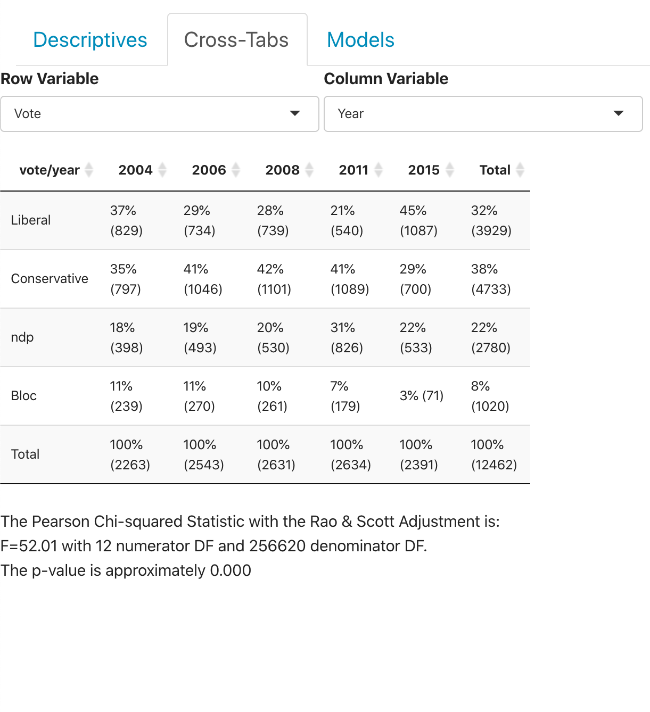

```{r setup, include=FALSE}
knitr::opts_chunk$set(echo = TRUE)
```

## Understanding the Output

The output you are seeing above provides a cross-tabulations of the selected variables.  All of the results generated above use probability weights and were generated by the `survey` package in R.  For the sake of discussion and explanation, I have generated an example of the results you see above here: 



When a variable is chosen from the "Row Variable" selector and one is chosen from the "Column Variable" selector, a cross-tabulation (aka contingency table) is produced.  In the example directly above, we show the distribution of `vote` by election.  The main entries are weighted column percentages with weighted column frequencies in parentheses.  In essence, the goal would be to look across each row to identify trends in the column percentages.  For example, we see that there is considerable variation in the percentage of Liberal party vote over time.  The Liberal vote sqw its lowest percentage in 2011 and then more than doubled that percentage over time.  In contrast, the NDP vote seems relatively more stable over time, with the exception of a big vote pick-up in 2011.  

Along with the cross-tabulation, a mosaic plot is also produced.  This is a visual representation of the contingency table. 


In the mosaic plot, the width of each column in the display is proportional to the percentage of observations in each group represented on the horizontal axis.  Here the columns of data are roughly evenly sized because the sample size for the CES was roughly similar across all of the waves (roughly 2500).  The height of each colored segment in each column is proportional to the row percentage in each column of the table.  As such, this display provides a useful visualization of all elements of the cross-tabulation.  

This display is designed with [plotly](https://plot.ly/r/).  Hovering over the figure will activate several buttons on the top-right of the figure.  The one that looks like a camera  will allow you to download the plot as a `.png` file.  
