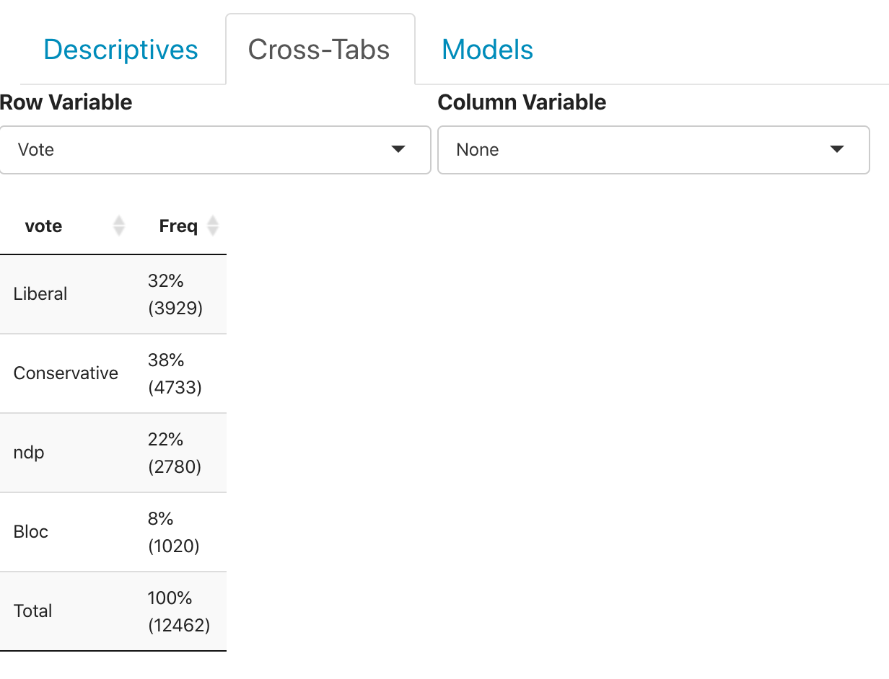

## Understanding the Output

The output you are seeing above provides the distribution of the selected variable.  All of the results generated above use probability weights and were generated by the `survey` package in R.  For the sake of discussion and explanation, I have generated an example of the results you see above here: 

When a variable is chosen from the "Row Variable" selector and no variable is chosen from the "Column Variable" selector, both frequency and relative frequency distributions are produced for the row variable selected.  In the example directly above, we  show the distribution of `vote` across all time-periods.  Here, we see that roughly 32% of respondents voted for the Liberal party and 38% for the Convservative party over all the years covered by the election.  The numbers in parentheses are the weighted frequencies rounded down to the nearest integer.  

This display is designed with [plotly](https://plot.ly/r/).  Hovering over the figure will activate several buttons on the top-right of the figure.  The one that looks like a camera  will allow you to download the plot as a `.png` file.  
